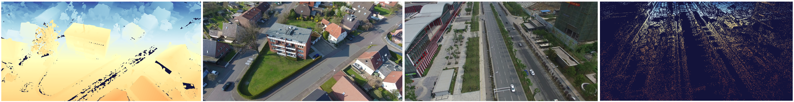

# UAVid-3D-Scenes



UAVid-3D-Scenes is a depth-estimation centric extension for the UAVid semantic dataset, organizing the original *sequences* based on the larger *scenes* they were captured in, providing **undistorted RGB frames** paired with **metric depth maps** obtained through COLMAP reconstructions and scaling.

🤗 Data is accessible on the projects huggingface repository https://huggingface.co/datasets/hrflr/uavid-3d-scenes

📃 This dataset accompanies the paper  **[TanDepth: Leveraging Global DEMs for Metric Monocular Depth Estimation in UAVs](https://ieeexplore.ieee.org/abstract/document/10848130)**

License: CC BY-NC-SA 4.0 [Creative Commons Attribution-NonCommercial-ShareAlike 4.0](https://creativecommons.org/licenses/by-nc-sa/4.0/)

## Recommended Citation

If you use this dataset in academic work, please cite the TanDepth paper and the original UAVid dataset.

**TanDepth (IEEE J-STARS, 2025)**

```bibtex
@ARTICLE{TanDepth2025,
  author={Florea, Horatiu and Nedevschi, Sergiu},
  journal={IEEE Journal of Selected Topics in Applied Earth Observations and Remote Sensing},
  title={TanDepth: Leveraging Global DEMs for Metric Monocular Depth Estimation in UAVs},
  year={2025},
  volume={18},
  pages={5445-5459},
  doi={10.1109/JSTARS.2025.3531984}
  url={https://ieeexplore.ieee.org/abstract/document/10848130}
}
```

**UAVid (source RGB data)**

```bibtex
@article{LYU2020108,
	author = "Ye Lyu and George Vosselman and Gui-Song Xia and Alper Yilmaz and Michael Ying Yang",
	title = "UAVid: A semantic segmentation dataset for UAV imagery",
	journal = "ISPRS Journal of Photogrammetry and Remote Sensing",
	volume = "165",
	pages = "108 - 119",
	year = "2020",
	issn = "0924-2716",
	doi = "https://doi.org/10.1016/j.isprsjprs.2020.05.009",
	url = {http://www.sciencedirect.com/science/article/pii/S0924271620301295},
}
```